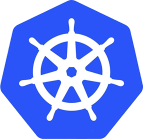
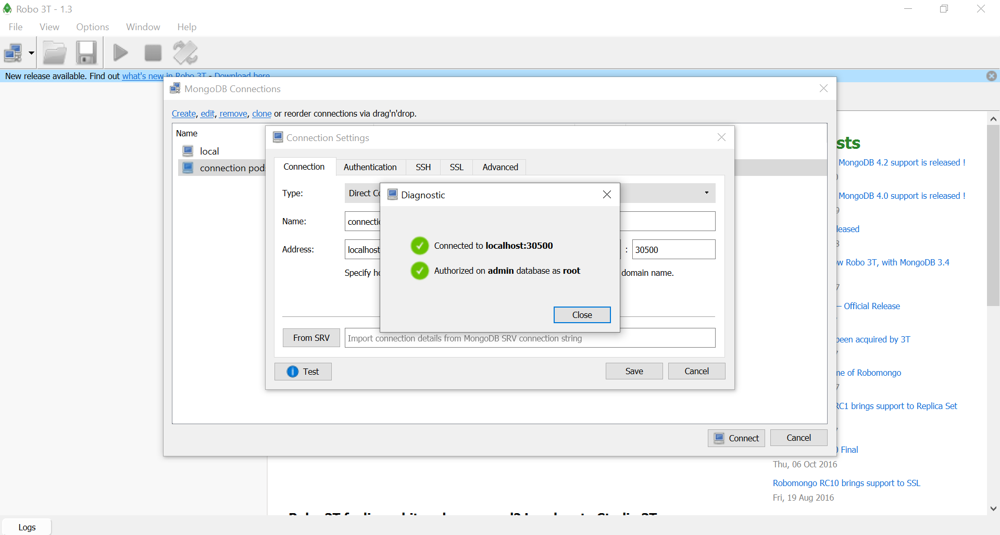

 #  Mongodb on  Kubernetes

## Create Cluster by KinD
***[KinD](https://kubernetes.io/blog/2020/05/21/wsl-docker-kubernetes-on-the-windows-desktop/): Kubernetes made easy in a container***. 
 
 
Right now, we have Docker that is installed, configured and the last test worked fine.

This is normal as we didn't enable the Docker Kubernetes cluster. So let's install KinD and create our first cluster.
 
>  *# Download the latest version of KinD*  
> curl -Lo ./kind https://github.com/kubernetes-sigs/kind/releases/download/v0.7.0/kind-$(uname)-amd64  
>  *# Make the binary executable*  
> chmod +x ./kind  
>  *# Move the binary to your executable path*  
>sudo mv ./kind /usr/local/bin/  

>  *# Create a config file for a nodes cluster*  
> kind-cluster.yaml 
>> kind: Cluster 
>> apiVersion: kind.x-k8s.io/v1alpha4 
>> nodes: 
>> &emsp;`-` role: control-plane 
>> &emsp;&ensp;&nbsp;extraPortMappings: 
>> &emsp;&emsp;&emsp;`-` containerPort: 30500 
>> &emsp;&emsp;&emsp;&emsp;hostPort: 30500 
>> &emsp;&emsp;&emsp;&emsp;listenAddress: "0.0.0.0" 

 Create Cluster

>  *# Create a new cluster with the config file*  
> kind create cluster --config ./kind-cluster.yaml  
>  *# Check how many nodes it created*  
kubectl get nodes  

 Create Service

>  *# Create YAML file for a new Service*  
> service-mongodb.yaml 
>> apiVersion: v1 
>> kind: Service 
>> metadata: 
>> &emsp;name: mongodb 
>> spec: 
>> &emsp;selector: 
>> &emsp;&emsp;app: database 
>> &emsp;ports: 
>> &emsp;&emsp;`-` protocol: TCP 
>> &emsp;&emsp;&emsp;port: 27017 
>> &emsp;&emsp;&emsp;targetPort: 27017 
>> &emsp;&emsp;&emsp;nodePort: 30500 
>> &emsp;type: NodePort 

>  *# Create a new Service*  
> kubectl apply -f service-mongodb.yaml

 Create Pod

>  *# Create YaaML file for a new Pod*  
> mongodb-pod.yaml 
>> apiVersion: v1 
>> kind: Pod 
>> metadata: 
>> &emsp;name: mongodb 
>> &emsp;labels: 
>> &emsp;&emsp;app: database 
>> spec: 
>> &emsp;containers: 
>> &emsp;&emsp;&ensp;`-` name: mongodb 
>> &emsp;&emsp;&emsp;&ensp;image: mongo:4.0.8 
>> &emsp;&emsp;&emsp;&ensp;env: 
>> &emsp;&emsp;&emsp;&emsp;&ensp;`-` name: MONGO_INITDB_ROOT_USERNAME 
>> &emsp;&emsp;&emsp;&emsp;&emsp;&ensp;value: "root" 
>> &emsp;&emsp;&emsp;&emsp;&ensp;`-` name: MONGO_INITDB_ROOT_PASSWORD 
>> &emsp;&emsp;&emsp;&emsp;&emsp;&ensp;value: "root" 

>  *# Create a new Pod*  
> kubectl apply -f mongodb-pod.yaml

  

## Test connect mongodb
 

  
